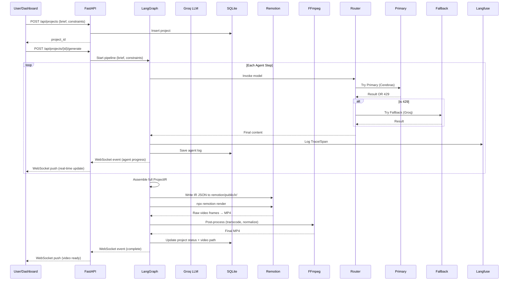

# System Architecture

## Executive Summary

A LangGraph-powered multi-agent system that transforms natural-language briefs into 30–40 second motion graphics videos. The system uses a strict Video IR (Intermediate Representation) as the single source of truth, with specialized AI agents that read/write only their owned sections. Remotion renders the IR into animated React compositions, and FFmpeg exports the final video.

---

## High-Level Topology

```
                    ┌──────────────────────────────────────────────┐
                    │              User / Dashboard                │
                    │         (Vite + React, WebSocket)            │
                    └─────────────────┬────────────────────────────┘
                                      │ REST + WS
                    ┌─────────────────▼────────────────────────────┐
                    │            FastAPI Backend                    │
                    │  ┌────────────────────────────────────────┐  │
                    │  │         LangGraph State Graph           │  │
                    │  │                                        │  │
                    │  │  ┌─────────┐    ┌──────────────────┐  │  │
                    │  │  │ Manager │───►│ Script/Storyboard│  │  │
                    │  │  │(Director)│    └────────┬─────────┘  │  │
                    │  │  └─────────┘             │            │  │
                    │  │                ┌─────────▼──────────┐ │  │
                    │  │                │ Visual Design/Layout│ │  │
                    │  │                └─────────┬──────────┘ │  │
                    │  │                ┌─────────▼──────────┐ │  │
                    │  │                │ Motion & Physics    │ │  │
                    │  │                └─────────┬──────────┘ │  │
                    │  │                ┌─────────▼──────────┐ │  │
                    │  │                │ Audio & SFX (stub) │ │  │
                    │  │                └─────────┬──────────┘ │  │
                    │  │                ┌─────────▼──────────┐ │  │
                    │  │                │ Render Orchestrator │ │  │
                    │  │                └─────────┬──────────┘ │  │
                    │  │                ┌─────────▼──────────┐ │  │
                    │  │                │     Verifier        │ │  │
                    │  │                └─────────┬──────────┘ │  │
                    │  │                     pass │ fail       │  │
                    │  │                     END ◄┘ ──► retry  │  │
                    │  └────────────────────────────────────────┘  │
                    │                                              │
                    │  ┌──────────┐  ┌───────────┐  ┌───────────┐ │
                    │  │ SQLite   │  │ Cerebras  │  │ Groq LLM  │ │
                    │  │ (state)  │  │ (Primary) │  │ (Fallback)│ │
                    │  └──────────┘  └─────┬─────┘  └─────┬─────┘ │
                    │                      │              │       │
                    │                ┌─────▼──────────────▼─────┐ │
                    │                │    Fallback Router       │ │
                    │                └─────────────┬────────────┘ │
                    └──────────────────────────────┼──────────────┘
                                                   │ writes IR JSON
                    ┌──────────────────▼───────────────────────────┐
                    │           Remotion Project (TS/React)         │
                    │  ┌─────────────────────────────────────────┐ │
                    │  │ IR JSON → React Components → Frames     │ │
                    │  │                                         │ │
                    │  │ Scene Types:                             │ │
                    │  │  KineticText, ShapeReveal, DataViz,     │ │
                    │  │  SplitScreen, FullBleed                  │ │
                    │  │                                         │ │
                    │  │ Animation Engine:                        │ │
                    │  │  spring(), interpolate(), transitions    │ │
                    │  └─────────────────────────────────────────┘ │
                    └──────────────────┬───────────────────────────┘
                                       │ renders frames
                    ┌──────────────────▼───────────────────────────┐
                    │           FFmpeg Post-Processing              │
                    │  Mux, transcode, loudness norm, export       │
                    └──────────────────────────────────────────────┘
```

---

## Component Boundaries

| Component | Language | Responsibility | Owns |
|-----------|----------|---------------|------|
| **FastAPI Backend** | Python | API, WebSocket, orchestration | Project CRUD, job management |
| **LangGraph Agents** | Python | AI creativo pipeline + Observability | IR generation, Langfuse tracing |
| **Fallback Router** | Python | Multi-provider resiliency | 429 Error detection, model switching |
| **Remotion Project** | TypeScript | Animation rendering | Component tree, frame output |
| **FFmpeg** | CLI | Video post-processing | Final MP4 encoding |
| **Dashboard** | TypeScript | User interface | Project management, preview |
| **SQLite** | — | Persistence | Projects, logs, checkpoints |

---

## Data Flow



---

## Agent Communication Pattern

**IR-as-Shared-State**: All agents operate on a shared LangGraph `TypedDict` state object. Each agent:

1. **Reads** the full state (previous agents' outputs)
2. **Writes** only its owned keys
3. **Never** directly communicates with other agents

The Manager sets the plan. Each specialist agent reads upstream outputs and produces its downstream contribution. The Renderer assembles everything into the final IR.

### Ownership Map

| State Key | Owner Agent |
|-----------|-------------|
| `brief`, `constraints`, `plan` | Manager |
| `script`, `storyboard` | Script & Storyboard |
| `theme`, `layouts` | Visual Design |
| `motion_plan` | Motion & Physics |
| `audio_plan` | Audio & SFX |
| `ir`, `remotion_code`, `render_path` | Renderer |
| `verification` | Verifier |

---

## Security & Isolation

- Agents cannot execute arbitrary code — they produce structured JSON that deterministic compilers translate to Remotion components
- LLM outputs are validated against schemas before being written to state
- Remotion render runs in a subprocess with timeout limits
- FFmpeg runs with argument validation (no shell injection)
- SQLite is local-only, no network exposure

---

## Scalability Notes (Future)

- Replace SQLite with Postgres for multi-user
- Containerize Remotion renders (Docker) for parallel execution
- Add Redis pub/sub for multi-instance WebSocket
- LangGraph Cloud for managed agent execution
